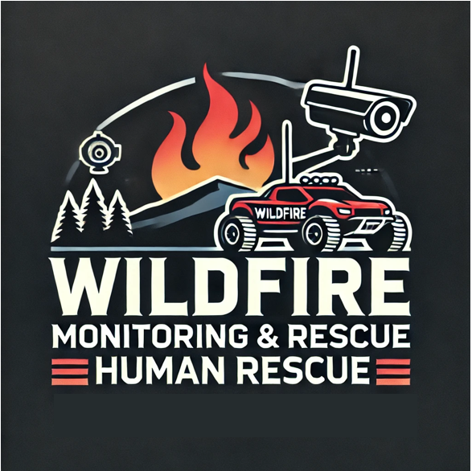

<h1 align="center">산불 감시 및 인명 구조를 위한 객체 인식 프로젝트</h1>

<p align="center">
  
</p>

### 산불 감시 및 인명 구조를 위한 RC 카 기반 객체 인식 기술

---

## Demo Video 

프로젝트의 시연 영상을 확인해보세요:

[](https://youtube.com/shorts/qTjb0LFu7_o)


## Project Description

이 프로젝트는 객체 인식 기술을 활용하여 산불 감시와 인명 구조에 사용할 수 있는 RC 카를 개발하는 것입니다. 시스템은 YOLOv5를 사용하여 인간과 화염을 인식하는 것을 목표로 하며, RC 카는 원격으로 제어되며 카메라와 라즈베리 파이(Raspberry Pi)를 탑재하여 실시간 비디오 스트리밍과 객체 인식을 수행합니다. 특정 객체(인간 또는 화염)가 감지되면, 시스템은 메시지 서비스와 이메일을 통해 경고를 전송하고, 감지된 이미지를 사전에 설정된 수신자에게 전송합니다.


## Features

- **원격 순찰**: RC 카는 원격으로 지정된 구역을 순찰하며, 실시간 비디오를 스트리밍합니다.
- **객체 인식**: 시스템은 특정 객체(인간, 화염)를 인식하여 경고를 전송합니다.
- **경고 시스템**: 객체가 감지되면 SMS 및 이메일을 통해 경고를 전송합니다.
- **전방향 이동**: RC 카는 메카넘 휠을 장착하여 모든 방향으로 이동할 수 있어 험난한 지형에서도 기동성을 발휘합니다.

## Development

| 항목            | 내용                                           |
|-----------------|------------------------------------------------|
| **플랫폼**      | Raspberry Pi 3, Raspberry Pi 4                |
| **프로그래밍**  | Python                                         |
| **라이브러리**  | OpenCV, YOLOv5, MJPG-Streamer, Torch, Requests |
| **하드웨어**    | RC 카, 메카넘 휠, Pi 카메라                    |
| **메시징**      | 네이버 클라우드 메시징 서비스                  |
| **운영 체제**   | Raspbian (64-bit)                              |

---

## System Architecture 

이 프로젝트는 두 개의 주요 컴포넌트로 구성됩니다:

1. **객체 인식 시스템**: 
   - **소프트웨어**: YOLOv5를 활용하여 실시간 객체 인식을 수행합니다.
   - **하드웨어**: 라즈베리 파이가 RC 카를 제어하고 카메라로부터 비디오 피드를 처리합니다.
   - **기능**: 객체를 감지하고 경고를 전송하며, 감지 기록을 저장합니다.

2. **RC 카 제어 시스템**:
   - **소프트웨어**: Python 스크립트를 사용하여 감지된 객체에 따라 카의 움직임을 제어합니다.
   - **하드웨어**: 메카넘 휠을 통해 RC 카가 모든 방향으로 이동할 수 있습니다.

---

## Installation & Setup

### 1. 객체 인식 설정

- **YOLOv5 설치**:
    ```bash
    git clone https://github.com/ultralytics/yolov5
    cd yolov5
    pip install -r requirements.txt
    ```
- **라즈베리 파이 설정**:
    - 필요한 종속성을 설치합니다.
    - Pi 카메라를 설정하고 `sudo raspi-config`를 통해 활성화합니다.
    - MJPG-Streamer를 설치하여 비디오 스트리밍을 설정합니다.

### 2. RC 카 제어

- **GPIO 설정**:
    - 모터 제어를 위한 GPIO 핀을 구성합니다.
    - Python `RPi.GPIO` 라이브러리를 사용하여 카의 움직임을 제어합니다.

### 3. 경고 시스템 구성

- **메시징 서비스**:
    - 네이버 클라우드 메시징 서비스에 등록하고 설정합니다.
    - API 키와 전화번호를 Python 스크립트에 구성합니다.

---

## Usage 

1. **객체 인식 시작**:
    ```bash
    python detect.py --weights yolov5s.pt --source 0  # 웹캠 사용 시
    ```
2. **RC 카 제어**:
    - 컨트롤러나 스크립트를 사용하여 카의 이동 명령을 전송합니다.

3. **경고 수신**:
    - 객체가 감지되면 등록된 이메일로 현장 사진이 전송되며, SMS로 경고 문자가 전송됩니다.

---

## Results

- **성공**: 시스템은 인간과 화염을 성공적으로 감지하고 경고를 전송했습니다.
- **도전 과제**: 라즈베리 파이의 성능이 제한적이어서 감지 프레임 속도에 영향을 미쳤습니다. 향후 개선에는 더 높은 성능의 하드웨어를 사용하는 것이 좋습니다.
- **개선점**: 카의 외관을 더 내열성이 높은 재질로 업그레이드해야 화재 지역에서 사용이 가능합니다.

---

## Contributors

- **팀 이름**: 김남재와 아이들

| 이름       | 역할                                                        |
|------------|-------------------------------------------------------------|
| **[팀장]김남재** | RC 카 제어 시스템 개발 총괄 및 하드웨어(RC카) 설계               |
| **신윤호** | RC 카 제어 시스템 개발 지원 |
| **황영진** | 객체 인식 시스템 개발, 모델링, 데이터 수집 및 데이터 셋 구성     |
| **김주완** | 객체 인식 시스템 개발, 모델링, 데이터 수집, 이메일 전송 및 문자 알림 기능 구현, 데이터 셋 구성 |
| **나영우** | 객체 인식 시스템 개발 지원                |
| **이성수** | 객체 인식 시스템 개발 지원              |
